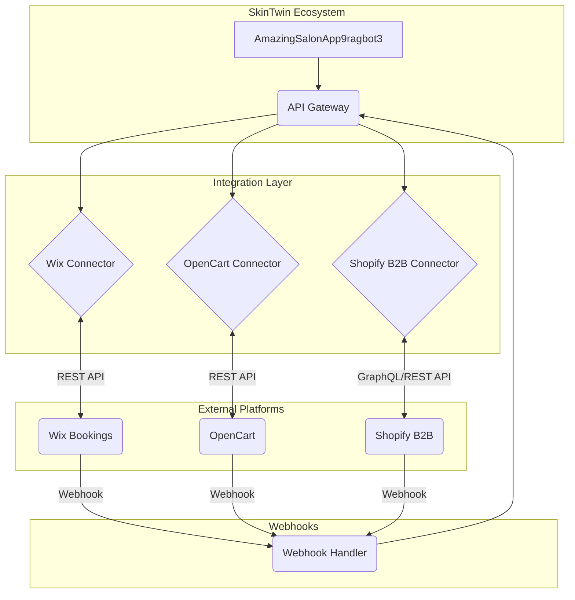

# SkinTwin Unified Integration Architecture

## 1. Introduction

This document outlines the architecture for integrating the SkinTwin Cognitive Alchemist Workbench with Wix Appointment Bookings, OpenCart, and the B2B Shopify ecosystem. The goal is to create a seamless, unified platform that synchronizes data across these systems, providing a single source of truth for appointments, customer information, and product inventory.

## 2. High-Level Architecture

The proposed architecture is based on a modular, event-driven design. The core of the integration will be a set of services that act as connectors to each external platform. These connectors will be responsible for handling API communication, data transformation, and synchronization.

A central API gateway will expose a unified API for the frontend application to interact with, abstracting the complexities of the individual platform APIs. Webhook handlers will be used to receive real-time updates from the external platforms.

### Architectural Diagram

## 3. Data Models and Mapping

A unified data model will be established to ensure consistency across all platforms. The existing database schema will be extended to accommodate the additional data from the external platforms. The following table outlines the proposed data mapping:

| SkinTwin Model | Wix Bookings | OpenCart | Shopify B2B |
|---|---|---|---|
| `Appointment` | `Booking` | `Order` | `Order` / `DraftOrder` |
| `Client` | `Contact` | `Customer` | `Customer` / `CompanyContact` |
| `Product` | - | `Product` | `Product` |
| `Service` | `Service` | - | - |

## 4. Authentication

Secure storage and management of API credentials for each platform are critical. The application will use a centralized configuration management system to store API keys, secrets, and access tokens. The `utils/config_utils.py` will be extended to manage these credentials.

## 5. Synchronization Strategy

Data synchronization will be achieved through a combination of webhooks and periodic polling.

- **Webhooks**: Real-time updates will be handled by a dedicated webhook handler service. This service will receive notifications from the external platforms and trigger the appropriate actions in the SkinTwin application.
- **Polling**: For platforms that do not provide webhooks for all necessary events, a periodic polling mechanism will be implemented to fetch updates at regular intervals.

## 6. Platform-Specific Integration Details

### 6.1. Wix Appointment Bookings

- **Connector**: A new `wix_connector.py` module will be created to handle all interactions with the Wix Bookings API.
- **Data Sync**: Appointments will be synchronized in both directions. New bookings in Wix will be created as appointments in the salon app, and vice-versa.
- **Webhooks**: Webhooks will be used for real-time updates on booking creation, updates, and cancellations.

### 6.2. OpenCart

- **Connector**: An `opencart_connector.py` module will be created for OpenCart API communication.
- **Data Sync**: Products and orders will be synchronized. New products created in the salon app will be pushed to OpenCart, and new orders in OpenCart will be reflected in the salon app.
- **Authentication**: The connector will handle the session-based authentication required by the OpenCart API.

### 6.3. Shopify B2B

- **Connector**: A `shopify_connector.py` module will be developed to interact with the Shopify Admin API (both REST and GraphQL).
- **Data Sync**: The integration will focus on B2B features, including company management, catalogs, and draft orders. Customer and order data will be synchronized between the salon app and Shopify.
- **B2B Features**: The connector will leverage Shopify's B2B-specific objects like `Company`, `CompanyLocation`, and `CompanyContact`.

